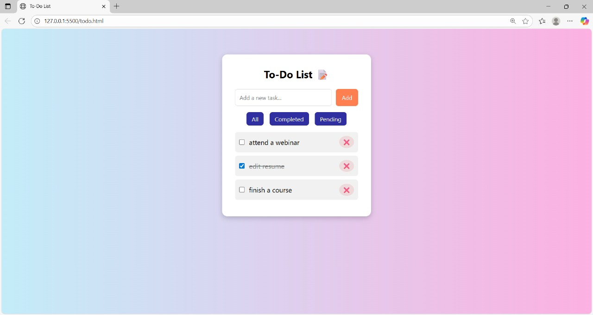

# 📝 Beautiful To-Do List Web App

A creative and interactive To-Do List built using **HTML**, **CSS**, and **JavaScript**. It allows users to add, complete, delete, and filter tasks — all within a clean, responsive, and beautifully designed interface.

---

## 🚀 Features

- ✅ Add new tasks
- ✅ Mark tasks as completed
- ✅ Delete tasks
- ✅ Filter tasks: *All, **Completed, **Pending*
- ✅ Stylish and mobile-friendly design
- ✅ Smooth scrolling inside the task box
- ✅ Elegant gradient background and responsive layout

---

## 📸 Preview

---

## 💻 Tech Stack

- *HTML* – Structure
- *CSS* – Styling & Layout
- *JavaScript* – Dynamic Functionality

---

## 📂 Project Structure
